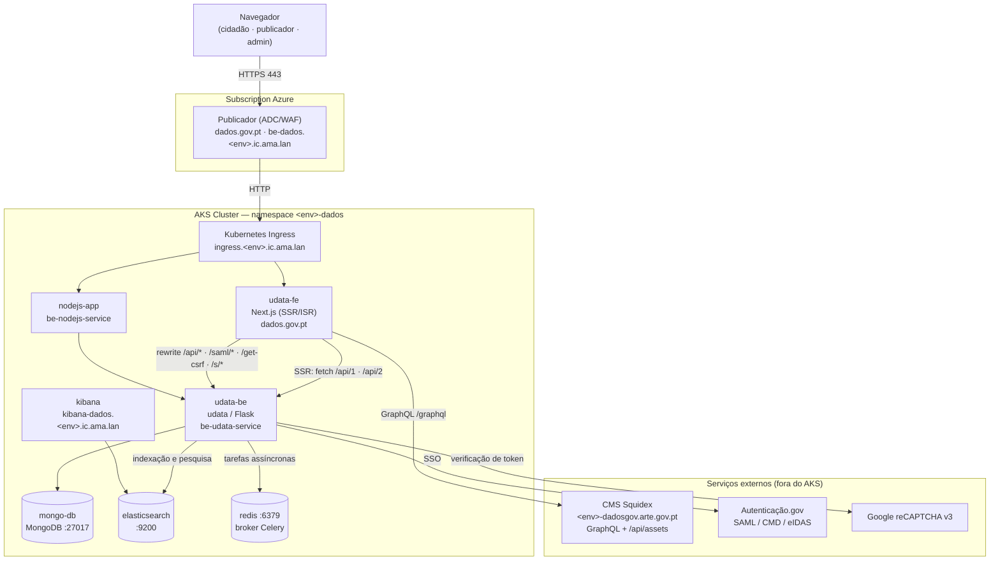
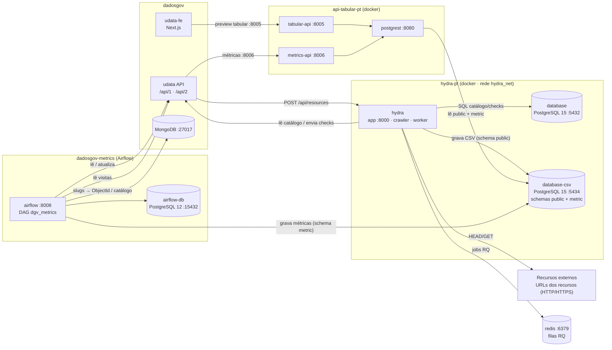

# Diagrama de Implantação (C4) — dados.gov.pt

Vista de implantação (*deployment*) do C4 Model do portal **dados.gov.pt** e das suas ligações: o **frontend** (`udata-fe`, Next.js), o **backend** (`udata-be`, udata/Flask) e os serviços satélites **hydra-pt**, **api-tabular-pt** e **dadosgov-metrics**.

> **Nota C4** — a *Deployment view* é a vista suplementar que mapeia os containers em nós de infraestrutura. No C4 clássico o "Nível 4" é o de Código; o que se pretende aqui é o diagrama de implantação com as ligações entre serviços.

**Fonte dos nós:** [Dados_Gov_-_Infrastructure.dsl](Dados_Gov_-_Infrastructure.dsl) (Structurizr DSL) para a topologia AKS; ficheiros de configuração dos stacks Docker (`.env`, `variables.json`, `connections.json`, `setup.py`) para as ligações entre serviços.

---

## Sistemas e repositórios

| Sistema                 | Container(s) no DSL                                                                                 | Repositório                        | Papel                                                                     |
| ----------------------- | --------------------------------------------------------------------------------------------------- | ---------------------------------- | ------------------------------------------------------------------------- |
| **dadosgov — frontend** | `udata-fe`                                                                                          | `github.com/amagovpt/dadosgov-fe`  | Interface web pública e backoffice (Next.js, SSR/ISR + proxy `/api/*`)     |
| **dadosgov — backend**  | `udata-be`, `nodejs-app`                                                                            | `github.com/amagovpt/udata-pt`     | API REST udata (`/api/1`, `/api/2`), autenticação SAML, tarefas Celery     |
| **Dados do dadosgov**   | `mongo-db`, `elasticsearch`, `kibana`, `redis`                                                       | —                                  | Catálogo (MongoDB), pesquisa (Elasticsearch/Kibana), broker Celery (Redis) |
| **hydra-pt**            | `hydra-app`, `hydra-postgres`, `hydra-postgres-csv`                                                  | `hydra-pt`                         | Crawler de recursos, *checks* de disponibilidade, conversão de CSV         |
| **api-tabular-pt**      | `tabular-api`, `metrics-api`, `postgrest`                                                            | `api-tabular-pt`                   | Serve dados tabulares e métricas a partir da `database-csv`               |
| **dadosgov-metrics**    | `airflow-app`, `airflow-scheduler`, `airflow-worker`, `airflow-flower`, `airflow-triggerer`, `airflow-postgres` | `dadosgov-metrics`      | DAGs Airflow que calculam e gravam métricas                               |
| **Infraestrutura**      | `aksclusternode`, `k8singress`, `Publicador`, `spk-DevOps-CICD-route-subnet-<env>`                    | —                                  | Nó AKS, ingress Kubernetes, publicador (ADC/WAF) e *route table* Azure     |

---

## Diagrama 1 — dadosgov (frontend + backend)



**Pontos a retomar:**

- Os pedidos *client-side* do browser **nunca** chamam o backend diretamente: passam pelos *rewrites* de `frontend/next.config.ts` (`/api/*`, `/saml/*`, `/get-csrf`, `/confirm/*`, `/reset/*`, `/s/*`, `/swaggerui/*`) para `BACKEND_URL`.
- Os *Server Components* do Next.js fazem *fetch* server-to-server ao `udata-be` no momento do *request*, com ISR (`next: { revalidate: N }`).
- Os conteúdos editoriais (notícias, páginas, menus) vêm do **CMS Squidex** por GraphQL (`API_URL_INTERNAL` no servidor, `NEXT_PUBLIC_API_URL` no browser) — o CMS corre fora do cluster AKS, pelo que uma indisponibilidade do CMS afeta as páginas públicas em SSR.
- O `udata-be` é o único ponto de acesso ao MongoDB, ao Elasticsearch e ao Redis.

---

## Diagrama 2 — Integração com hydra-pt, api-tabular-pt e dadosgov-metrics



---

## Legenda das ligações

### A — dadosgov (frontend ↔ backend ↔ dados)

| #   | Origem                       | Destino                    | Protocolo / porta            | Propósito                                                                                            |
| --- | ---------------------------- | -------------------------- | ---------------------------- | ---------------------------------------------------------------------------------------------------- |
| A1  | Navegador                    | Publicador → Ingress → `udata-fe` | HTTPS :443                   | Páginas públicas e backoffice (o Publicador faz *offload* TLS; o ingress encaminha para o *namespace*). |
| A2  | `udata-fe` (Server Components) | `udata-be`                 | HTTP `/api/1`, `/api/2` (`BACKEND_URL`) | Dados renderizados no servidor (SSR/ISR): datasets, organizações, reutilizações, homepage agregada.  |
| A3  | Navegador → `udata-fe` (proxy) | `udata-be`                 | HTTP `/api/*` (rewrite Next) | Pedidos *client-side* (filtros, formulários, upload em *chunks* de 2 MB) — nunca vão direto ao backend. |
| A4  | `udata-fe` (proxy)           | `udata-be`                 | HTTP `/saml/*`, `/get-csrf`, `/confirm/*`, `/reset/*`, `/s/*` | Autenticação, token CSRF, confirmação de email e *short links* servidos pelo host do frontend.        |
| A5  | `udata-fe`                   | CMS Squidex                | HTTPS `/graphql`, `/api/assets` | Conteúdos editoriais e *assets* (`API_URL_INTERNAL` / `NEXT_PUBLIC_API_URL`).                        |
| A6  | `udata-be`                   | `mongo-db`                 | Mongo :27017 (`MONGODB_HOST`) | Catálogo completo: datasets, recursos, organizações, utilizadores, discussões.                        |
| A7  | `udata-be`                   | `elasticsearch`            | HTTP :9200 (`ELASTICSEARCH_URL`) | Indexação e pesquisa facetada do catálogo.                                                            |
| A8  | `kibana`                     | `elasticsearch`            | HTTP :9200                   | Consulta e diagnóstico dos índices (`kibana-dados.<env>.ic.ama.lan`).                                  |
| A9  | `udata-be` (worker / beat)   | `redis`                    | Redis :6379 (`CELERY_BROKER_URL`) | Broker das tarefas Celery (harvest, notificações, métricas internas).                                  |
| A10 | `udata-be`                   | Autenticação.gov           | SAML (HTTP-POST)             | Login CMD / Cartão de Cidadão / eIDAS.                                                                |
| A11 | `udata-be`                   | Google reCAPTCHA v3        | HTTPS                        | Validação do token dos formulários públicos (`GOOGLE_RECAPTCHA_SECRET_KEY`).                          |
| A12 | `nodejs-app`                 | `udata-be`                 | HTTP (cluster interno)       | Serviço Node publicado em `be-dados.<env>.ic.ama.lan` (PPR/PRD); em DEV/TST fica interno.             |

### B — Serviços satélites

| #   | Origem                       | Destino                    | Protocolo / porta                     | Propósito                                                                            |
| --- | ---------------------------- | -------------------------- | ------------------------------------- | ------------------------------------------------------------------------------------ |
| B1  | hydra (crawler/worker)       | udata API                  | HTTPS `/api/1`, `/api/2`              | Lê o catálogo e envia resultados de *check*/análise (`CATALOG_URL`, `UDATA_URI`).     |
| B2  | udata API                    | hydra (app)                | HTTP `POST /api/resources`            | Eventos de criação/alteração de recurso (prioriza *crawl*).                            |
| B3  | hydra (crawler)              | Recursos externos          | HTTP/HTTPS                            | HEAD/GET aos URLs dos recursos do catálogo (dados.gov.pt e terceiros).                 |
| B4  | hydra (crawler/worker)       | Redis                      | Redis :6379                           | Fila de *jobs* RQ (10.55.37.142).                                                      |
| B5  | hydra                        | `database` (:5432)         | SQL (rede `hydra_net`)                | Catálogo, *checks*, metadados.                                                         |
| B6  | hydra (worker)               | `database-csv` (:5434)     | SQL (rede `hydra_net`)                | Grava tabelas convertidas de CSV (schema `public`).                                    |
| B7  | postgrest                    | `database-csv`             | SQL `host.docker.internal:5434`       | Lê `public` (tabular) e `metric` (métricas).                                            |
| B8  | tabular-api                  | postgrest                  | HTTP :8080                            | Serve dados tabulares.                                                                 |
| B9  | metrics-api                  | postgrest                  | HTTP :8080                            | Serve métricas (schema `metric` via `Accept-Profile`).                                 |
| B10 | dadosgov (frontend / API)    | tabular-api (:8005)        | HTTP                                  | Pré-visualização de dados tabulares.                                                   |
| B11 | dadosgov (frontend / API)    | metrics-api (:8006)        | HTTP                                  | Consumo de métricas.                                                                   |
| B12 | airflow (DAG)                | MongoDB udata              | Mongo :27017                          | Resolve *slugs* → ObjectId e lê catálogo.                                              |
| B13 | airflow (DAG)                | udata API                  | HTTP                                  | Lê/atualiza catálogo (`UDATA_INSTANCE_URL`).                                            |
| B14 | airflow (DAG)                | `database-csv`             | SQL `host.docker.internal:5434`       | Grava métricas no schema `metric`.                                                     |
| B15 | airflow                      | `airflow-db` (:15432)      | SQL                                   | Metadados do próprio Airflow (PostgreSQL 12).                                           |

---

## O elo central

A `database-csv` do hydra-pt (porta 5434) é o ponto de integração dos quatro sistemas:

```text
hydra worker ──(escreve schema public)──▶  database-csv  ◀──(escreve schema metric)── dadosgov-metrics
                                                │
                                                │ (lê ambos os schemas)
                                                ▼
                                            PostgREST ──▶ tabular-api / metrics-api ──▶ dadosgov (udata-fe / udata-be)
```

---

## Topologia AKS por ambiente

Todos os ambientes seguem o mesmo padrão: **Publicador** (na *Subscription* Azure) recebe os *hostnames* públicos e reencaminha para o **Kubernetes Ingress** (`ingress.<env>.ic.ama.lan`), que encaminha para o *namespace* `<env>-dados` do **AKS Cluster Node**. Cada ambiente tem também a sua *route table* `spk-DevOps-CICD-route-subnet-<env>`.

### Hostnames publicados

| Container       | DEV                              | TST                              | PPR                                                     | PRD                                                |
| --------------- | -------------------------------- | -------------------------------- | ------------------------------------------------------- | -------------------------------------------------- |
| `k8singress`    | `ingress.dev.ic.ama.lan`         | `ingress.tst.ic.ama.lan`         | `ingress.ppr.ic.ama.lan`                                | `ingress.prd.ic.ama.lan`                           |
| `udata-fe`      | `dados.dev.ic.ama.lan`           | `dados.tst.ic.ama.lan`           | `ppr.dados.gov.pt` · `dados.ppr.ic.ama.lan`             | **`dados.gov.pt`** · `dados.prd.ic.ama.lan`        |
| `nodejs-app`    | interno                          | interno                          | `be-dados.ppr.ic.ama.lan`                               | `be-dados.prd.ic.ama.lan`                          |
| `airflow-app`   | `airflow-dados.dev.ic.ama.lan`   | `airflow-dados.tst.ic.ama.lan`   | `airflow-dados.ppr.ic.ama.lan`                          | `airflow-dados.prd.ic.ama.lan`                     |
| `kibana`        | `kibana-dados.dev.ic.ama.lan`    | `kibana-dados.tst.ic.ama.lan`    | `kibana-dados.ppr.ic.ama.lan`                           | `kibana-dados.prd.ic.ama.lan`                      |
| `elasticsearch` | interno                          | interno                          | interno · `ppr-ee.dados.gov.pt`                         | interno                                            |

### Serviços internos do *namespace* `<env>-dados`

O padrão é `<serviço>.<env>-dados.svc.cluster.local`:

| Container            | Serviço interno              | Papel                                    |
| -------------------- | ---------------------------- | ---------------------------------------- |
| `udata-fe`           | (exposto via ingress)        | Frontend Next.js                         |
| `udata-be`           | `be-udata-service`           | API udata (Flask)                        |
| `nodejs-app`         | `be-nodejs-service`          | Serviço Node                             |
| `mongo-db`           | `mongo-db-service`           | Catálogo udata                           |
| `elasticsearch`      | `elasticsearch-service`      | Índices de pesquisa                      |
| `kibana`             | (exposto via ingress)        | UI de consulta ao Elasticsearch          |
| `redis`              | `redis-service`              | Broker Celery / filas RQ                 |
| `hydra-app`          | `hydra-service`              | Crawler / *checks* de recursos           |
| `hydra-postgres`     | `hydra-postgres-service`     | Catálogo e *checks* do hydra             |
| `hydra-postgres-csv` | `hydra-postgres-csv-service` | `database-csv` (schemas `public`+`metric`) |
| `tabular-api`        | `tabular-api-service`        | Dados tabulares                          |
| `metrics-api`        | `metrics-api-service`        | Métricas                                 |
| `postgrest`          | `postgrest-service`          | Camada REST sobre a `database-csv`       |
| `airflow-app`        | (exposto via ingress)        | UI e API do Airflow                      |
| `airflow-scheduler`  | —                            | Escalonamento de DAGs                    |
| `airflow-worker`     | —                            | Execução de tarefas                      |
| `airflow-flower`     | —                            | Monitorização das *queues*               |
| `airflow-triggerer`  | —                            | *Deferrable operators*                   |
| `airflow-postgres`   | `airflow-postgres-service`   | Metadados do Airflow                     |

### Hostnames recebidos pelo Publicador

| Ambiente | Recebe                                                                                                                              | Reencaminha para          |
| -------- | ----------------------------------------------------------------------------------------------------------------------------------- | ------------------------- |
| DEV      | `dados.dev.ic.ama.lan`, `airflow-dados.dev.ic.ama.lan`, `kibana-dados.dev.ic.ama.lan`                                                 | `ingress.dev.ic.ama.lan`  |
| TST      | `dados.tst.ic.ama.lan`, `airflow-dados.tst.ic.ama.lan`, `kibana-dados.tst.ic.ama.lan`                                                 | `ingress.tst.ic.ama.lan`  |
| PPR      | `ppr.dados.gov.pt`, `dados.ppr.ic.ama.lan`, `be-dados.ppr.ic.ama.lan`, `ppr-ee.dados.gov.pt`, `airflow-dados.ppr.ic.ama.lan`, `kibana-dados.ppr.ic.ama.lan` | `ingress.ppr.ic.ama.lan`  |
| PRD      | `dados.gov.pt`, `dados.prd.ic.ama.lan`, `be-dados.prd.ic.ama.lan`, `airflow-dados.prd.ic.ama.lan`, `kibana-dados.prd.ic.ama.lan`       | `ingress.prd.ic.ama.lan`  |

---

## Endpoints observados (variam por ambiente)

| Serviço        | Endereços observados nos configs                                                                                   |
| -------------- | ------------------------------------------------------------------------------------------------------------------ |
| udata API      | `172.31.204.12` (hydra `UDATA_URI`, metrics `.env`); `10.55.37.38` (metrics `variables.json`); `dados.gov.pt` (catálogo público) |
| MongoDB udata  | `10.55.37.40` (`connections.json`); `10.55.37.143` (`.env` / script Matomo)                                        |
| Redis          | `10.55.37.142:6379`                                                                                                 |
| CMS Squidex    | `ppr-dadosgov.arte.gov.pt`, `prd-dadosgov.arte.gov.pt` (CSP do frontend); `http://localhost:3333` em local          |
| Backend local  | `http://localhost:7000` (`BACKEND_URL`, `frontend/.env`)                                                            |

---

## Notas

- Os 3 stacks Docker (hydra-pt, api-tabular-pt, dadosgov-metrics) correm no mesmo *host*; `api-tabular` e `metrics` chegam à BD do hydra por `host.docker.internal:5434` (porta publicada), enquanto o próprio hydra usa a rede interna `hydra_net` (`database-csv:5432`).
- O código dos DAGs do dadosgov-metrics provém do repositório `datagouvfr_data_pipelines` (montado no container Airflow) — é dependência de código, não um serviço em *runtime*, por isso não aparece no diagrama.
- Os IPs internos diferem entre ambientes (local/distribuído); ver a tabela de endpoints e o `setup.py` (topologia).
- **CMS Squidex** e **Autenticação.gov** correm fora do cluster AKS e não constam do DSL de infraestrutura, mas são dependências de *runtime* das páginas públicas e do login — foram incluídas nos diagramas por isso.
- O DSL expõe três *pods* de aplicação em `<env>-dados`: `udata-fe` (frontend, *host* público), `udata-be` (API udata, serviço interno) e `nodejs-app` (serviço Node publicado em `be-dados.<env>.ic.ama.lan` apenas em PPR/PRD). A ligação A12 reflete essa topologia tal como declarada no DSL — confirmar com a equipa de DevOps o papel exato do `nodejs-app` face ao `udata-be`.
- Este ficheiro `.md` é a fonte do documento. Para regenerar a versão `.docx`:
  `python3 scripts/md_to_docx.py docs/c4/deployment-c4.md docs/c4/deployment-c4.docx --landscape`
  Os blocos ` ```mermaid ` são renderizados para PNG com `@mermaid-js/mermaid-cli` (via `npx`) e embebidos como imagens; sem acesso ao `npx`/`mmdc` o conversor mantém o código do diagrama como texto.
